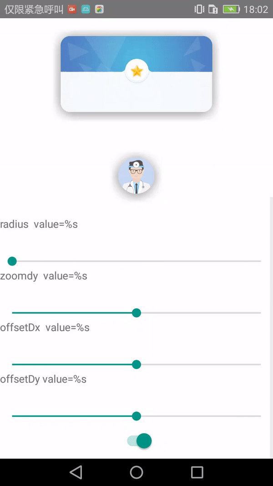
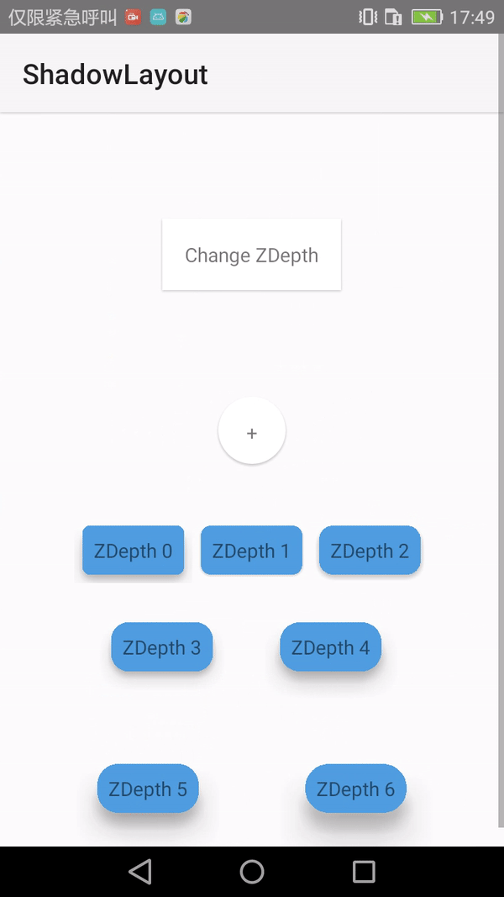
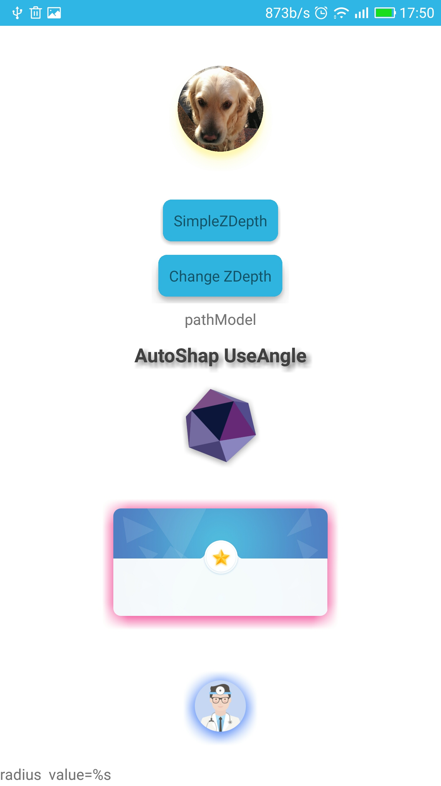
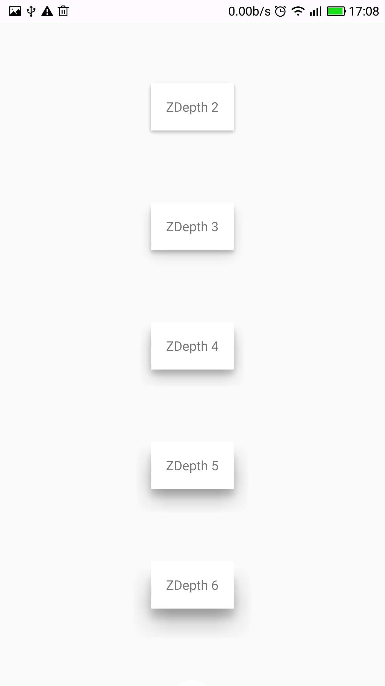
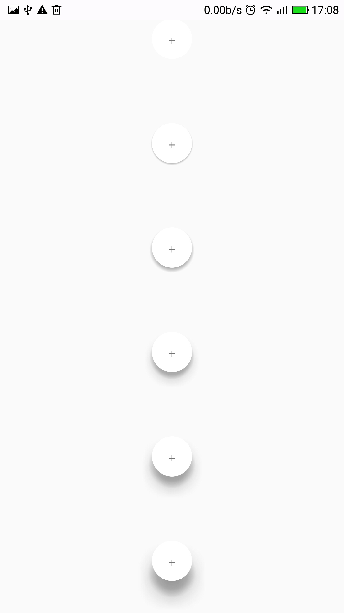
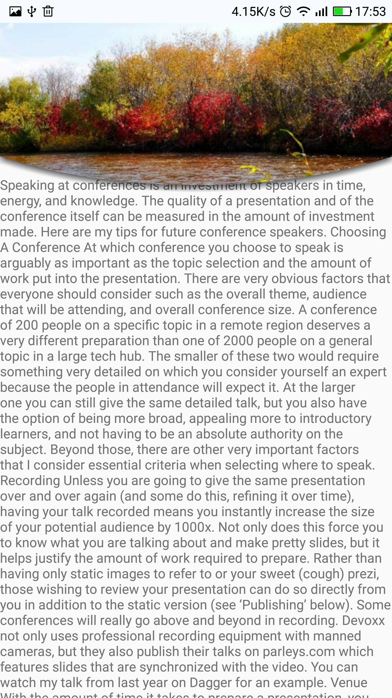
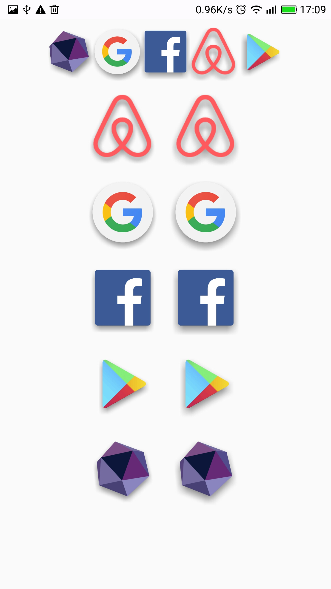
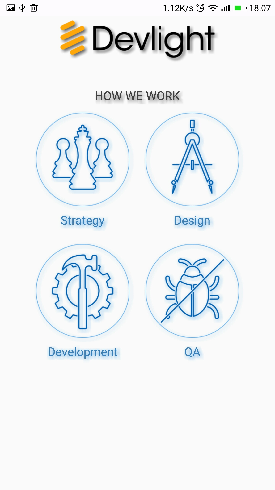
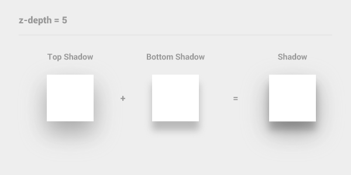

ShadowLayout
==================

Android  powerful library- draw any shape of z-depth shadow of MaterialDesign,auto fit shape ,roundRect , Circle, clipe Path shape all be supportted

## Demo



## Screen Capture










  







## Download

```groovy
apply plugin: 'com.android.application'

repositories {
    maven {
        url "https://jitpack.io"
    }
}

android {
    // something code...
}

dependencies {
    compile 'com.github.ShogoMizumoto:ZDepthShadowLayout:1.0.4'
}
```

## How to Use

ShapeModel

```xml
 <com.ytjojo.shadowlayout.ShadowLayout
            android:layout_width="wrap_content"
            android:layout_height="wrap_content"
            shadow:sl_shadow_model="shadowShape"
            shadow:z_depth="z_depth3"
            shadow:z_depth_shape="rect">

            <TextView
                android:layout_width="wrap_content"
                android:layout_height="wrap_content"
                android:background="@android:color/white"
                android:padding="16dp"
                android:text="ZDepth 3" />

</com.ytjojo.shadowlayout.ShadowLayout>
```

Shapmodel clip

```xml
<com.ytjojo.shadowlayout.ShadowLayout
    android:id="@+id/ovalShapeSl"
    android:layout_width="wrap_content"
    android:layout_height="wrap_content"
    android:visibility="visible"
    app:sl_shadow_model="shadowShape"
    app:z_depth="z_depth3"
    app:z_depth_clipcanvas="true"
    app:z_depth_shape="oval">

    <ImageView
        android:layout_width="80dp"
        android:layout_height="80dp"
        android:scaleType="centerCrop"
        android:src="@drawable/quila" />
</com.ytjojo.shadowlayout.ShadowLayout>
```

autoModel

```xml
<com.ytjojo.shadowlayout.ShadowLayout
    android:layout_width="wrap_content"
    android:layout_height="wrap_content"
    app:sl_shadow_color="#83111111"
    app:sl_shadow_offsetdx="0dp"
    app:sl_shadow_offsetdy="5dp"
    app:sl_shadow_radius="8dp"
    app:sl_shadow_zoomdy="-1dp">

    <ImageView
        android:layout_width="80dp"
        android:layout_height="80dp"
        android:layout_gravity="center"
        android:scaleType="centerCrop"
        android:src="@drawable/airbnb" />
</com.ytjojo.shadowlayout.ShadowLayout>
```

auto model  use angle

```xml
<com.ytjojo.shadowlayout.ShadowLayout
    android:layout_width="wrap_content"
    android:layout_height="wrap_content"
    android:visibility="visible"
    app:sl_shadow_angle="45"
    app:sl_shadow_color="#9e000000"
    app:sl_shadow_distance="4dp"
    app:sl_shadow_radius="4dp">

    <ImageView
        android:layout_width="wrap_content"
        android:layout_height="56dp"
        android:layout_marginBottom="68dp"
        android:adjustViewBounds="true"
        android:src="@drawable/ic_logo" />

    <TextView
        android:layout_width="wrap_content"
        android:layout_height="wrap_content"
        android:layout_gravity="bottom|center_horizontal"
        android:text="HOW WE WORK"
        android:textColor="#414141"
        android:textSize="18sp"
        android:typeface="sans" />

</com.ytjojo.shadowlayout.ShadowLayout>
```




PathModel

```xml
<com.ytjojo.shadowlayout.ShadowLayout
    app:sl_shadow_model="shadowPath"
    app:shadow_path_coordinatex1="0.3"
    app:shadow_path_coordinatey1="0.9"
    app:shadow_path_coordinatex2="0.7"
    app:shadow_path_coordinatey2="0.9"
    app:shadow_path_startleft_y_rate="0.7"
    app:shadow_path_endright_y_rate="0.7"
    app:sl_shadow_offsetdy="1dp"
    android:layout_width="match_parent"
    android:layout_height="200dp">
    <ImageView
        android:src="@drawable/fengjing"
        android:scaleType="centerCrop"
        android:layout_width="match_parent"
        android:layout_height="wrap_content" />
</com.ytjojo.shadowlayout.ShadowLayout>
```


you can custom path

```java
PathModel pathModel= (PathModel) shadowLayout.getShadowDeltegate();
pathModel.setPath(mCustomPath);
```


### Attribute


#### attrs.xml

```xml
<declare-styleable name="ShadowLayout">
        <attr name="sl_shadowed" format="boolean"/>
        <attr name="sl_shadow_distance" format="dimension"/>
        <attr name="sl_shadow_offsetdx" format="dimension"/>
        <attr name="sl_shadow_offsetdy" format="dimension"/>
        <attr name="sl_shadow_zoomdy" format="dimension"/>
        <attr name="sl_shadow_angle" format="integer"/>
        <attr name="shadow_path_startleft_y_rate" format="float"/>
        <attr name="shadow_path_endright_y_rate" format="float"/>
        <attr name="shadow_path_coordinatex1" format="float"/>
        <attr name="shadow_path_coordinatey1" format="float"/>
        <attr name="shadow_path_coordinatex2" format="float"/>
        <attr name="shadow_path_coordinatey2" format="float"/>
        <attr name="z_depth_clipcanvas" format="boolean"/>
        <attr name="sl_shadow_radius" format="dimension"/>
        <attr name="sl_shadow_rectroundradius" format="dimension"/>
        <attr name="sl_shadow_color" format="color"/>
        <attr name="sl_shadow_model" format="enum">
            <enum name="auto" value="0"/>
            <enum name="shadowShape" value="1"/>
            <enum name="shadowPath" value="2"/>
        </attr>
        <attr name="z_depth" format="enum">
            <enum name="z_depth0" value="0"/>
            <enum name="z_depth1" value="1"/>
            <enum name="z_depth2" value="2"/>
            <enum name="z_depth3" value="3"/>
            <enum name="z_depth4" value="4"/>
            <enum name="z_depth5" value="5"/>
            <enum name="z_depth6" value="6"/>
        </attr>
        <attr name="z_depth_shape" format="enum">
            <enum name="rect" value="0"/>
            <enum name="oval" value="1"/>
        </attr>
        <attr name="z_depth_padding" format="enum">
            <enum name="z_depth0" value="0"/>
            <enum name="z_depth1" value="1"/>
            <enum name="z_depth2" value="2"/>
            <enum name="z_depth3" value="3"/>
            <enum name="z_depth4" value="4"/>
            <enum name="z_depth5" value="5"/>
        </attr>
        <attr name="z_depth_paddingLeft" format="enum">
            <enum name="z_depth0" value="0"/>
            <enum name="z_depth1" value="1"/>
            <enum name="z_depth2" value="2"/>
            <enum name="z_depth3" value="3"/>
            <enum name="z_depth4" value="4"/>
            <enum name="z_depth5" value="5"/>
        </attr>
        <attr name="z_depth_paddingTop" format="enum">
            <enum name="z_depth0" value="0"/>
            <enum name="z_depth1" value="1"/>
            <enum name="z_depth2" value="2"/>
            <enum name="z_depth3" value="3"/>
            <enum name="z_depth4" value="4"/>
            <enum name="z_depth5" value="5"/>
        </attr>
        <attr name="z_depth_paddingRight" format="enum">
            <enum name="z_depth0" value="0"/>
            <enum name="z_depth1" value="1"/>
            <enum name="z_depth2" value="2"/>
            <enum name="z_depth3" value="3"/>
            <enum name="z_depth4" value="4"/>
            <enum name="z_depth5" value="5"/>
        </attr>
        <attr name="z_depth_paddingBottom" format="enum">
            <enum name="z_depth0" value="0"/>
            <enum name="z_depth1" value="1"/>
            <enum name="z_depth2" value="2"/>
            <enum name="z_depth3" value="3"/>
            <enum name="z_depth4" value="4"/>
            <enum name="z_depth5" value="5"/>
        </attr>
        <attr name="z_depth_animDuration" format="integer"/>
        <attr name="z_depth_doAnim" format="boolean"/>
    </declare-styleable>
```

## What is ZDepth?


#### Example : z-depth 5




